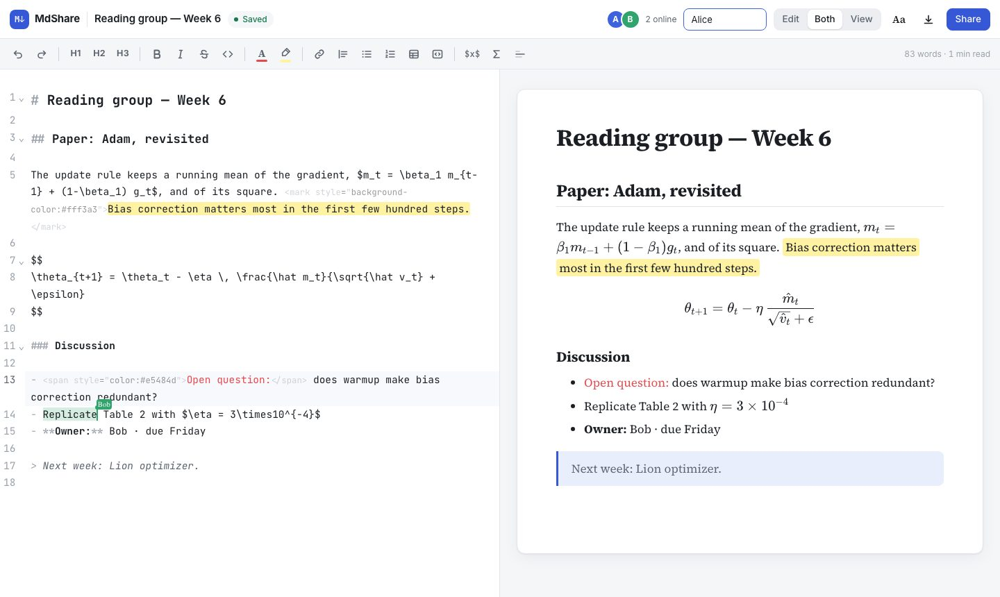
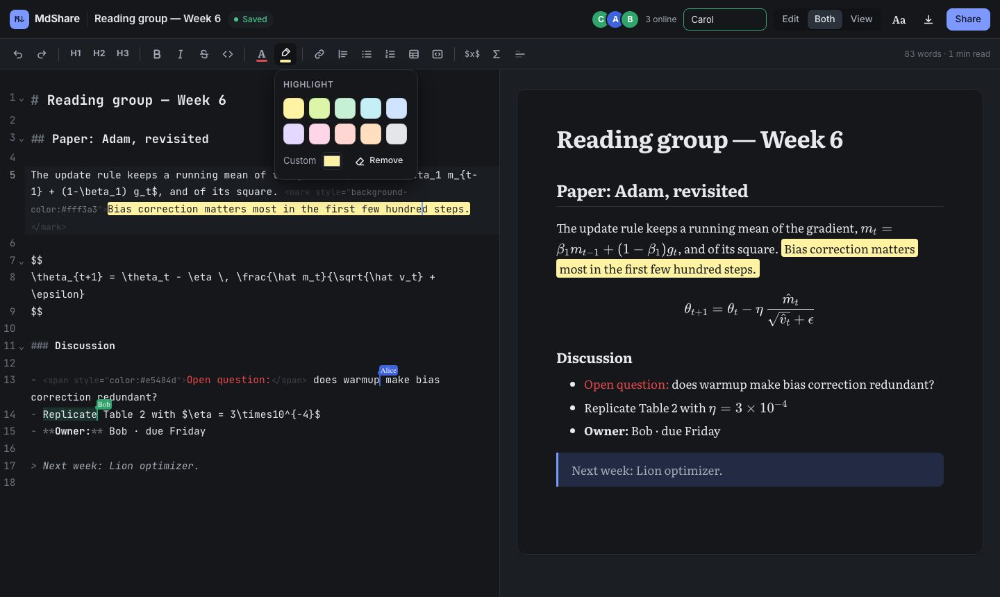
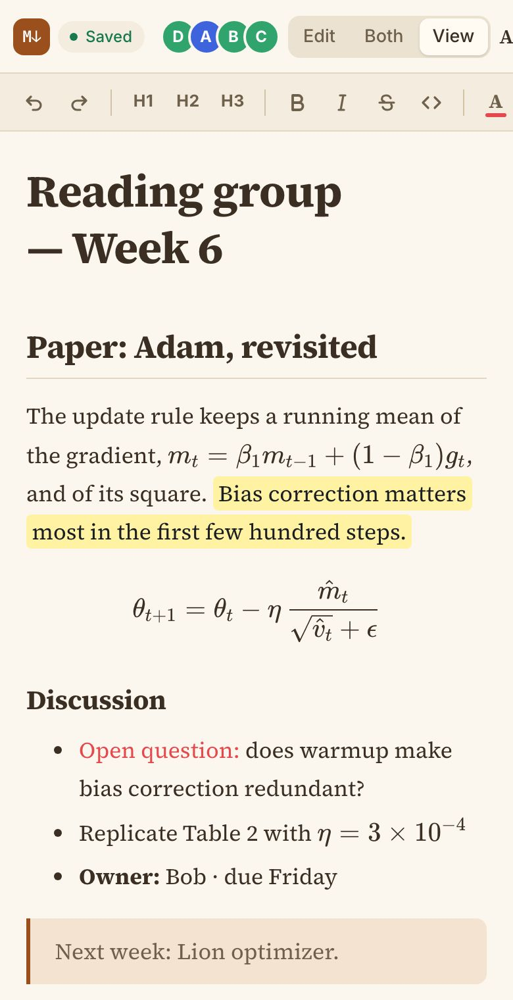
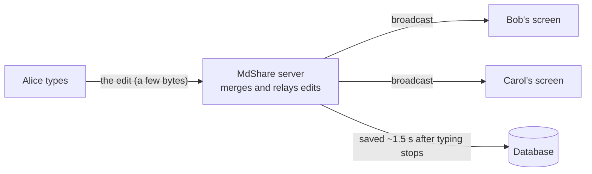
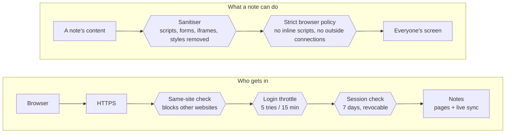

# MdShare

> **Write the notes, the equations and the to-do list together, live.**

MdShare is a shared notebook for research groups. Open a link and everyone types into the same page
at once, with LaTeX math that renders as you write. It runs on your own server, so your notes stay with you.



<sub>A real session: Alice writes on the left, the page renders on the right, and Bob's cursor (green label) is editing the same note at the same moment.</sub>

**Contents:**
[What it is](#what-it-is) ·
[Who it's for](#who-its-for) ·
[What it does](#what-it-does) ·
[Why it helps](#why-it-helps) ·
[Security](#security) ·
[Product description](#product-description) ·
[Installation](#installation) ·
[Quick start](#quick-start) ·
[Run it for your group](#run-it-for-your-group) ·
[Keeping secrets out of git](#keeping-secrets-out-of-git) ·
[Development](#development-and-tests) ·
[Roadmap](#roadmap) ·
[FAQ](#faq)

---

## What it is

A web app for writing **shared notes in Markdown with LaTeX math**. Several people edit the same note at
the same time and see each other's cursors, while a formatted preview with properly typeset equations
updates as they type. There is no project setup and no compile step, and notes are plain Markdown you can take anywhere.

| | |
| --- | --- |
| **In one line** | Google-Docs-style live editing for Markdown + LaTeX, on your own server |
| **Format** | Plain Markdown with `$…$` and `$$…$$` math |
| **Runs as** | One Node.js process and one SQLite file, ideally behind HTTPS |
| **Used in** | Any modern browser, desktop or phone |

## Who it's for

The core user is a **research group of 5–40 people** that meets weekly and keeps shared notes.

- **Research labs and groups:** meeting notes, experiment logs and derivations that everyone edits during the meeting.
- **Reading groups and journal clubs:** one page per paper with the key equations, open questions and who follows up.
- **Supervisors and PhD students:** a running supervision log with feedback, next steps and the maths being discussed.
- **Teaching teams:** tutorial sheets, worked solutions and live problem-solving in class.
- **Small R&D teams:** design and modelling notes where the formulas matter and the data must stay in-house.
- **Departments and research IT:** a tool that can run on university infrastructure, with no per-seat licence and no notes sent to a vendor's cloud.

## What it does

| | |
| --- | --- |
| **Write together, live** | Everyone edits the same note at once, and changes merge automatically, with no "someone else is editing" locks. Named, coloured cursors show who is where, plus a count of who's online. Short connection drops are fine: edits sync when you reconnect. |
| **Math that renders as you type** | Inline `$…$` and display `$$…$$` LaTeX, typeset by KaTeX. Edit, side-by-side or reading view. Code blocks with syntax colouring. |
| **A formatting toolbar** | Headings, bold, italic, strikethrough, code, lists, quotes, links, tables and equations, with keyboard shortcuts. Everything is undoable with Ctrl+Z. |
| **Text colour and highlights** | 10 preset colours or any custom colour. Everyone sees them, and they stay in the downloaded file. |
| **Read it your way** | Each person chooses their own editor and reading fonts, text size, page width, and Light, Paper or Dark theme. Works on phones. |
| **AI rephrase (optional)** | Select a passage and Claude suggests a clearer version with the same meaning, keeping math and formatting exact. Edit it, or ask for "shorter" or "more formal", before replacing. It never overwrites a colleague's edit made in the meantime. |

<p>
  
  &nbsp;
  
</p>
<sub>The same note in the dark theme with the highlight palette open, and on a phone in the Paper theme. Each person's theme is their own choice.</sub>

### How live editing works



Each keystroke sends only the change, not the whole note. Everyone's copy merges to the same text even
when people type at the same moment (Yjs, a conflict-free data type).

## Why it helps

| Situation | Without MdShare | With MdShare |
| --- | --- | --- |
| Equations in meeting notes | Photos of the whiteboard, or LaTeX pasted as raw text | Type `$\eta = 3\times10^{-4}$` and everyone sees it typeset |
| Several note-takers | One person types; others email corrections afterwards | Everyone writes into the same page during the meeting |
| Finding last month's notes | Scattered across inboxes, chats and personal files | One list of notes, newest first, for the whole group |
| Reusing notes later | Locked in a document format, export needed | Plain Markdown: paste into a paper draft, a README or slides |
| Where the data lives | A vendor's cloud, under its terms | Your server and one database file you can back up |
| Cost | Per-seat subscriptions that grow with the group | No per-seat fee when self-hosted. One small server runs it |

**Compared with the usual alternatives** (by category; individual products differ):

| | MdShare | Cloud document editors | LaTeX project editors | Files on a shared drive |
| --- | --- | --- | --- | --- |
| Live co-editing | **Yes**, named cursors | Yes | Yes | No: copies conflict |
| Typing LaTeX math | **Yes**, renders instantly | Limited equation tools | Yes, after a compile | Depends on the file |
| Quick notes, no setup | **Yes**: open a link | Yes | Needs a project | Open, edit, re-upload |
| Portable plain-text format | **Markdown** (.md) | Export needed | .tex source | Varies |
| Runs on your own server | **Yes**, by design | Usually vendor-hosted | Some offer it | If the drive is yours |

## Security

Every request passes several independent checks, and every note is cleaned before it reaches anyone's screen.



**Protected today**

- **Private by default.** Without a password the server only accepts connections from the computer it runs on. It refuses to go on a network without a password of at least 12 characters.
- **Revocable logins.** Sessions are stored on the server, and only a SHA-256 hash of each token is kept. Logging out instantly disconnects open editors, and changing the password logs everyone out.
- **Password guessing is slowed:** after 5 wrong attempts, that address is blocked for 15 minutes.
- **Other websites can't act for you.** Changes and live (WebSocket) connections are only accepted from MdShare's own pages, checked with the `Origin` header.
- **Notes can't attack readers.** HTML in notes passes through DOMPurify and a strict Content-Security-Policy: no scripts, forms, iframes or outside images, and only `color`/`background-color` styles.
- **Hardened deployment.** The Docker image runs as a non-root user with a read-only filesystem and no Linux capabilities. Behind HTTPS, cookies become `__Host-` + `Secure` and HSTS is sent.
- **AI is opt-in and minimal.** It's off until an administrator adds a key. Only the selected passage is sent, only when someone clicks Rephrase, and use is rate-limited per person.

**Not covered yet**

- **One shared group password.** Everyone with it can read and edit every note. Personal sign-in and per-note roles are the next milestone (M4).
- **No version history yet.** Back up the database file regularly.
- **HTTPS is your hosting's job.** Use the included Caddy setup, and never expose MdShare on a network without HTTPS.
- **Not yet independently audited or load-tested at scale.**

**Tested:** 33/33 security checks (logged-out access, forged cookies, cross-site requests, injected HTML,
throttling), 23/23 formatting and colour checks, 23/23 AI-rephrase checks, and a two-browser co-editing test.

Found a problem? Please report it privately; see [SECURITY.md](SECURITY.md).

## Product description

**MdShare is a self-hosted, real-time collaborative Markdown editor with LaTeX math, made for research groups.**
A group member creates a note and shares its link. Everyone who opens it edits the same text at the same time,
sees named cursors, and watches a typeset preview update with every keystroke. Edits from several people merge
automatically, so no one is ever locked out or asked to resolve a conflict.

Writing is quick for experts and newcomers alike. Markdown and LaTeX can be typed directly, or applied from a
toolbar with headings, lists, tables, code, links, equations, text colours and highlights. Each reader picks their
own fonts, text size, page width and theme. An optional AI assistant, powered by Anthropic's Claude, can
rephrase a selected passage while keeping its meaning, numbers and math intact. Nothing changes until the author accepts.

MdShare runs as a single small service with one database file, on a lab machine, a university virtual machine or a
low-cost cloud server. Notes stay on that server and download as plain `.md` files at any time.

| Specification | Detail |
| --- | --- |
| Deployment | Self-hosted: Docker Compose with a Caddy HTTPS proxy, or Node.js 20+ directly |
| Server footprint | One process and one SQLite database file. A small virtual machine is enough for a group |
| Real-time engine | [Yjs](https://yjs.dev) via [Hocuspocus](https://tiptap.dev/hocuspocus) over WebSocket |
| Editor and rendering | CodeMirror 6 · markdown-it · KaTeX · DOMPurify |
| Access control | Group password, server-side sessions (7 days), login throttling, Origin checks |
| AI (optional) | Anthropic Claude via your own API key. Off by default |
| Data portability | Every note downloads as Markdown; all notes live in one file you can back up |
| Clients | Modern desktop and mobile browsers (tested in Chromium) |

**Ways to use it:** run it yourself (self-hosted, no per-seat fee), have it hosted for your group (a managed
instance with HTTPS, backups and updates), or roll it out across a department on university infrastructure.

---

## Installation

MdShare needs **Node.js 20 or newer** (which includes `npm`) and **git**. Docker is only needed if you
deploy with Docker on a server.

### macOS

Install [Homebrew](https://brew.sh) if you don't have it, then Node.js and git:

```bash
/bin/bash -c "$(curl -fsSL https://raw.githubusercontent.com/Homebrew/install/HEAD/install.sh)"
brew install node git
```

### Windows

Install the LTS version of Node.js from [nodejs.org](https://nodejs.org) and [Git for Windows](https://git-scm.com/download/win),
or from PowerShell:

```powershell
winget install OpenJS.NodeJS.LTS
winget install Git.Git
```

Close and reopen the terminal afterwards so it finds the new commands.

### Linux (Ubuntu / Debian)

The `nodejs` package in the default repositories is often too old. Use NodeSource (or [nvm](https://github.com/nvm-sh/nvm)):

```bash
curl -fsSL https://deb.nodesource.com/setup_22.x | sudo -E bash -
sudo apt-get install -y nodejs git
```

### Check it worked

```bash
node --version    # should print v20 or higher
npm --version
git --version
```

### Docker (servers only)

For the Docker setup, install Docker Engine with the Compose plugin ([Linux guide](https://docs.docker.com/engine/install/))
or [Docker Desktop](https://docs.docker.com/desktop/) on macOS and Windows. Check with `docker compose version`.

## Quick start

```bash
git clone https://github.com/sourasb05/md_share.git
cd md_share
npm install
npm run build
npm start              # → http://localhost:3000
```

Open the same note in two browser windows to see live co-editing. Without a password the server only listens on
this computer (`127.0.0.1`), so nobody else on the network can reach it. Stop the server with Ctrl+C.

### Troubleshooting

| Problem | Fix |
| --- | --- |
| `command not found: node` / `'node' is not recognized` | Node.js isn't installed or the terminal was opened before installing. Install it (above) and open a new terminal |
| The page loads but the editor is blank | You skipped `npm run build`. Run it, then restart with `npm start` |
| `EADDRINUSE: address already in use` | Something else uses port 3000. Start on another port: `PORT=3001 npm start` (Windows PowerShell: `$env:PORT=3001; npm start`) |
| `GROUP_PASSWORD must be at least 12 characters.` | Choose a longer password |
| `Refusing to listen on 0.0.0.0 without GROUP_PASSWORD` | Sharing on a network requires a password. Set `GROUP_PASSWORD` as shown below |
| `npm install` fails while building `better-sqlite3` | Prebuilt files weren't available for your system. Install build tools and retry: macOS `xcode-select --install`, Ubuntu `sudo apt-get install -y build-essential python3`, Windows the "Desktop development with C++" workload of Visual Studio Build Tools |

On **Windows PowerShell**, set variables like this instead of `NAME=value npm start`:

```powershell
$env:GROUP_PASSWORD='choose-a-long-password'; $env:HOST='0.0.0.0'; npm start
```

## Run it for your group

Set a group password (at least 12 characters) so only your group can open notes:

```bash
GROUP_PASSWORD='choose-a-long-password' HOST=0.0.0.0 npm start
```

| Variable | Default | Meaning |
| --- | --- | --- |
| `PORT` | 3000 | HTTP + WebSocket port |
| `HOST` | `127.0.0.1` | Address to listen on. Anything other than localhost requires `GROUP_PASSWORD` |
| `GROUP_PASSWORD` | (empty = no login) | Shared password for the group, 12+ characters. Changing it logs everyone out |
| `TRUST_PROXY` | `loopback` | Which reverse proxies may set `X-Forwarded-For/Proto` ([Express syntax](https://expressjs.com/en/guide/behind-proxies.html)) |
| `DATA_DIR` | `./data` | Where `mdshare.sqlite` lives. Back this folder up |
| `ANTHROPIC_API_KEY` | (empty = AI off) | Turns on **Rephrase**. Get a key at console.anthropic.com |
| `AI_MODEL` | `claude-opus-5-5` | Claude model used for rephrasing |
| `AI_PER_MINUTE` | 10 | Rephrase requests allowed per person per minute (cost guard) |

### With Docker (recommended on a server)

```bash
cp .env.example .env      # then set the password (and the API key, if you want AI)
mkdir -p data && sudo chown 1000:1000 data   # the container runs as an unprivileged user
docker compose up -d --build
```

Put it behind HTTPS (Caddy, nginx, or your department's reverse proxy). The proxy must pass WebSocket upgrades and
the `Host` header through. A Caddy example is in [`Caddyfile.example`](Caddyfile.example).

### Backups

All notes live in `data/mdshare.sqlite`. Copy it regularly, e.g. nightly with
`sqlite3 data/mdshare.sqlite ".backup backup.sqlite"`. Store backups outside this repository.

## Keeping secrets out of git

This repository is public. Secrets and data are kept out by [`.gitignore`](.gitignore):

| Never commit | Why | Where it belongs |
| --- | --- | --- |
| `.env` | Holds `GROUP_PASSWORD` and `ANTHROPIC_API_KEY`. A leaked API key can run up charges on your account | Copy from `.env.example` on the server only |
| `data/`, `*.sqlite` | Everyone's notes, login sessions and the password fingerprint | The server's disk, plus your backups |
| Build output (`public/editor.js`, `public/chunks/`, `public/fonts/`…) | Recreated by `npm run build` | — |

If a key is ever pushed by mistake, **revoke it immediately** at console.anthropic.com. Deleting the commit
is not enough, because public history is copied quickly. GitHub secret scanning and push protection are
enabled on this repository as a second line of defence.

## Writing and formatting

The toolbar has undo/redo, headings, bold/italic/strikethrough/code, **text colour**, **highlight colour**
(10 presets each, or any custom colour), links, quotes, lists, tables, code blocks, inline and block math, and
dividers. Shortcuts: Ctrl/Cmd+B, I, E (code), K (link), Shift+X (strikethrough), Shift+H (highlight with the last colour).

Colours are stored in the note as small HTML tags, e.g. `<mark style="background-color:#fff3a3">text</mark>`,
so everyone sees them and they survive download. Only `color` and `background-color` are allowed in notes;
any other inline CSS is removed. Images in notes must be `data:` URLs for now (image paste is planned):
external image links are blocked so outside servers can't track who reads a note.

**Aa** (top right) sets your own editor font, preview font, text size, theme (Auto, Light, Paper, Dark) and
page width. These are personal and stored in your browser only.

**AI rephrase.** With `ANTHROPIC_API_KEY` set, a **Rephrase** button appears. Select a passage, click it, and
Claude suggests a rewrite with the same meaning. You can edit the suggestion or ask for something different,
then click **Replace selection**. The replacement is an ordinary edit: everyone sees it live and Ctrl+Z undoes it.

## Development and tests

```bash
npx playwright install chromium     # once
npm run build
npm start                           # terminal 1
npm test                            # terminal 2: two browsers type into one note at once
npm run test:formatting             # toolbar, colours, highlights, appearance (needs npm start)
npm run test:security               # starts its own server and tries to break in (33 checks)
npm run test:rephrase               # AI rephrase against a fake Claude API (no key, no cost)
```

Design choices are logged in [DECISIONS.md](DECISIONS.md). [CLAUDE.md](CLAUDE.md) has the rules for AI coding
assistants working on this project.

```
server.js          Express (pages, REST API, login, AI rephrase) + Hocuspocus (sync, saving)
src/editor.js      Note page: editor, toolbar, colours, preview, presence, AI panel
src/home.js        Notes list
public/            HTML, CSS, theme.js (npm run build adds bundles, KaTeX and fonts here)
scripts/build.mjs  Build: bundles browser code, copies KaTeX and fonts
test/              End-to-end, formatting, security and AI tests
docs/images/       Screenshots used in this README
data/              SQLite database (created on first run, never committed)
```

## Roadmap

| Milestone | Status |
| --- | --- |
| M1–M2 Editor, live preview, LaTeX math, real-time sync, cursors, who's online | ✅ Done |
| M3 Saving (SQLite), restart-safe, group password, Docker | ✅ Done |
| Security hardening: revocable sessions, throttling, same-site checks, stricter sanitising | ✅ Done |
| Editor 2.0: formatting toolbar, colours and highlights, themes and fonts, AI rephrase | ✅ Done |
| **M4 Personal sign-in, "My notes" / "Shared with me", private / view / edit links** | ⏭ Next |
| M5 Version history, image paste, Mermaid diagrams | Later |
| M6 Load testing, backup restore drill, further hardening | Later |

## FAQ

<details><summary><b>Where are our notes stored?</b></summary>

On the server you run MdShare on, in a single SQLite database file. Nothing is sent elsewhere, except the passages
someone explicitly asks the optional AI to rephrase.
</details>

<details><summary><b>Do we have to use the AI feature?</b></summary>

No. It stays off until an administrator sets `ANTHROPIC_API_KEY`. Without it, the Rephrase button doesn't appear.
</details>

<details><summary><b>Can we get our notes out?</b></summary>

Yes. Any note downloads as a plain Markdown file, and colours and highlights are kept as simple HTML tags.
</details>

<details><summary><b>What happens if the Wi-Fi drops mid-meeting?</b></summary>

Keep typing. Your edits are kept in the open page and merge with everyone else's when the connection returns.
MdShare is not an offline app, though, so closing the tab while disconnected loses unsynced edits.
</details>

<details><summary><b>How many people can edit at once?</b></summary>

It is designed for a research group and has been tested with up to four people in one note. Formal load testing is planned (M6).
</details>

## License

No license has been chosen yet, so all rights are reserved by the author for now. Add a `LICENSE` file before
inviting others to reuse or contribute.
